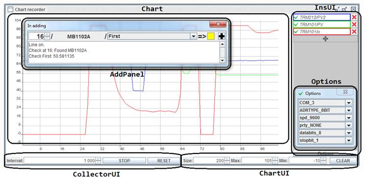
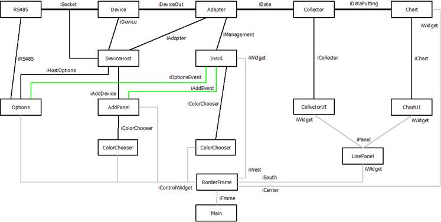

<html>
  <head><meta content="text/html; charset=windows-1251"></head>
  <body lang=ENG>
    <b>Chart recorder</b> it's a program for the parameters visualization of the measuring devices. Base on <a href="http://jchart2d.sourceforge.net/">JChart2D</a> and OvenIO libs. 
    You can download <a href="https://sites.google.com/site/programsandsource/files/ChartRecorder.zip">distributive</a> and <a href="https://sites.google.com/site/programsandsource/files/ChartRecorderSource.zip">Eclipse project</a>(without libs).
    

    UI visual components: 
    
    

    Internal architecture:   
     
    </body>
</html>
